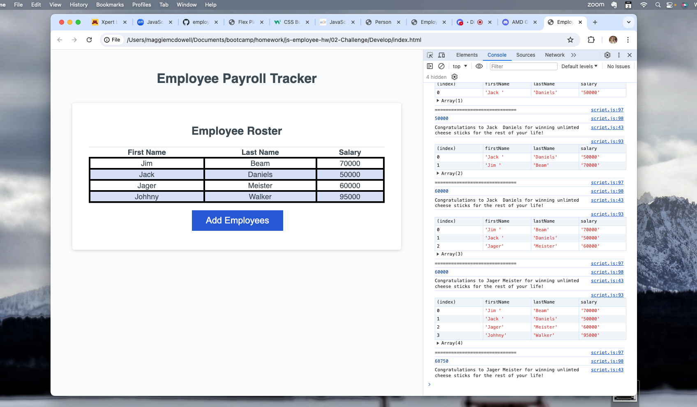

# employee.salary.doc

## Description 
This page is used to generate random employee names that a user puts in along with their salary. Then, in the dev console, it gives you the average of the salary and choses a random winner from the list of employees entered. 

## Screenshots

## Links
https://github.com/magtron3030/employee.salary.doc

